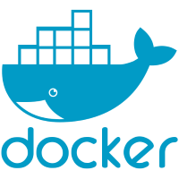

# **Despliegue de Aplicaciones Web**

### Información personal
**Alumno**: Ismael Pavón Huete  
**Curso**: DAW 2  
**Correo Personal**: pavonhueteismael@gmail.com  
**Correo Castelar**: dawipavonh@iescastelar.com  

### INDICE

    
UT-1

- [ut1-compose](./ut1-Compose/README.md)
- [ut1-docker](./ut1-Docker/README.MD)

    
UT-2

- [ut2-examen](./ut2/examen/README.md)

    
UT-3

- [ut3-jakarta](./ut3/jakartaEE/README.md)
- [ut3-laravel](./ut3/laravel/README.md)
- [ut3-nodejs](./ut3/node.js/README.md)
- [ut3-flask](./ut3/flask/README.md)

## **Tecnologías Utilizadas**

<table>
    <tr>
        <td align="center"><strong>VirtualBox</strong> </td>
        <td align="center"><strong>Vagrant</strong> </td>
        <td align="center"><strong>Docker</strong> </td>
        <td align="center"><strong>Git</strong> </td>
    </tr>
</table>

