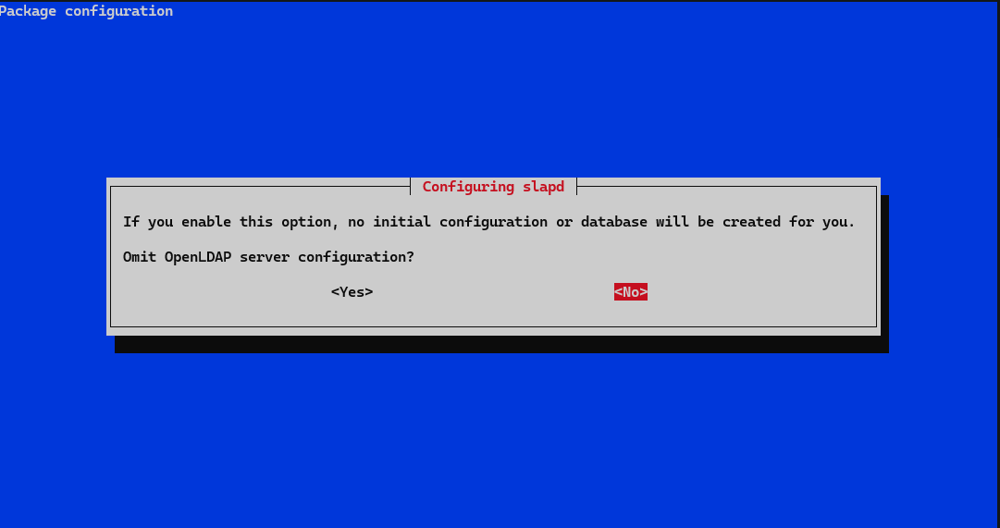
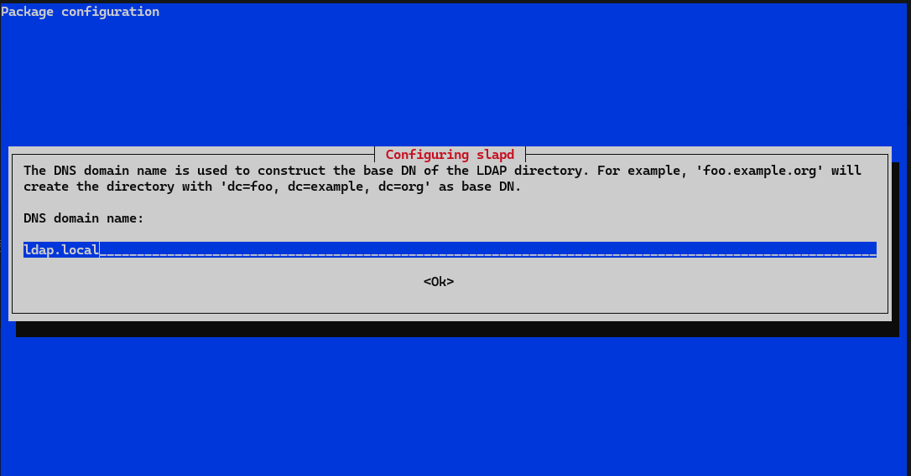
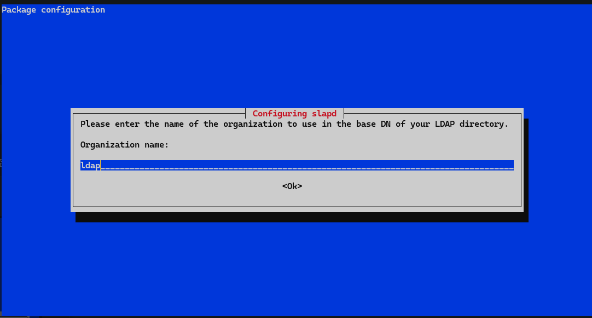
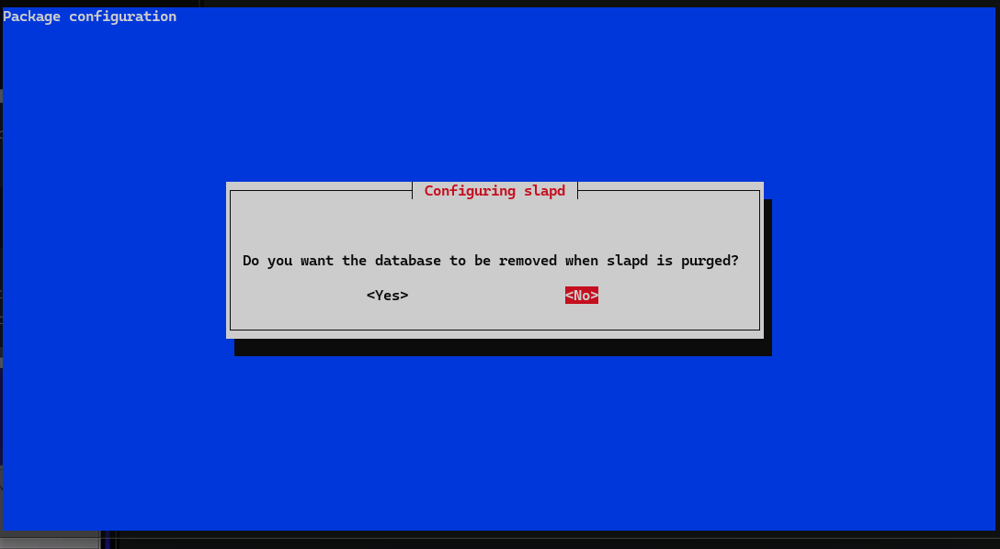
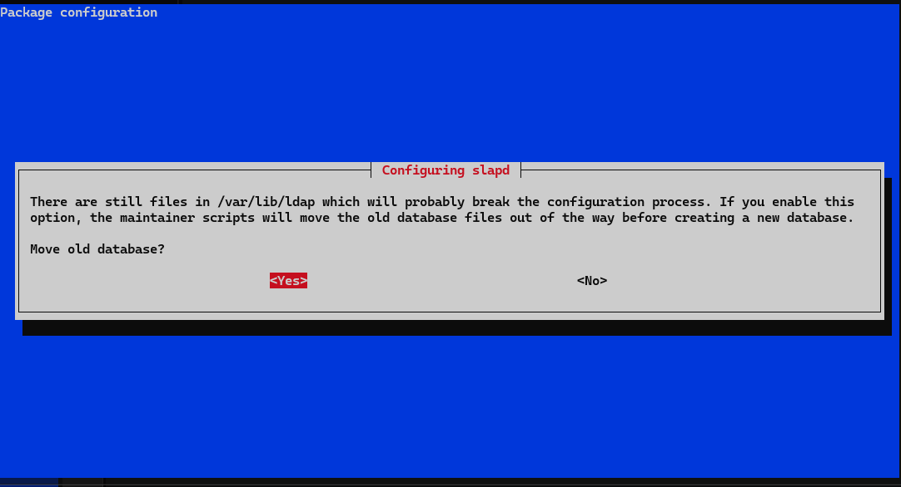

# LDAP

- Instalamos LDAP

```bash
sudo apt install slapd ldap-utils
```

- Verificamos que se ha instalado correctamente 

```bash
sudo slapcat
```

- Reconfiguramos algunas cosas del ldap

```bash
sudo dpkg-reconfigure slapd
```







- Creamos el user.ldif

```bash
sudo touch /etc/ldap/users.ldif
```

- Le añadimos este contenido en ese archivo en base a los datos que hallamos puesto antes en la reconfiguracion

```bash
dn: ou=People,dc=ldap,dc=local
objectClass: organizationalUnit
ou: People
```

- Lo añadimos al servidor de la siguiente manera

```bash
sudo ldapadd -D "cn=admin,dc=ldap,dc=local" -W -H ldapi:/// -f /etc/ldap/users.ldif
``` 

- Vamos a realizar una busqueda 

```bash
sudo ldapsearch -x -b "dc=ldap,dc=local" ou
```