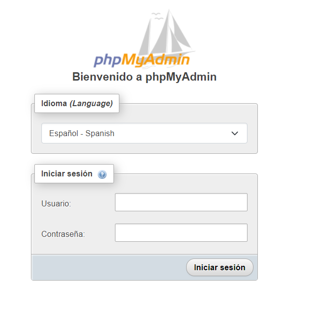
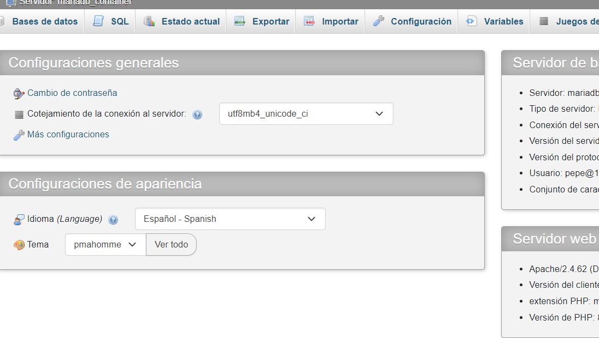
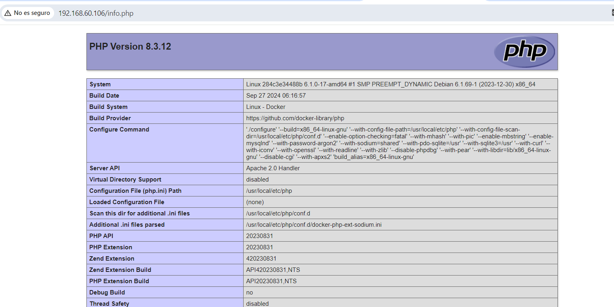

# **PRACTICA DOCKER CLI**

### **Pasos a seguir**

#### 1. Crear una red interna para la comunicación entre los contenedores

```bash
docker network create mired
```

#### 2. Descargar una imagen

```bash
vagrant@debian12:~$ docker pull mariadb
Using default tag: latest
latest: Pulling from library/mariadb
eda6120e237e: Pull complete
3bea7484bf1d: Pull complete
97768484d3db: Pull complete
f7c4ca00d7c4: Pull complete
200feec9a56a: Pull complete
4c3b42e2cd08: Pull complete
e287e4cde285: Pull complete
c19c18c0f9a2: Pull complete
Digest: sha256:9e7695800ab8fa72d75053fe536b090d0c9373465b32a073c73bc7940a2e8dbe
Status: Downloaded newer image for mariadb:latest
docker.io/library/mariadb:latest
```

#### 3. Ver las imágenes descargadas

```bash
vagrant@debian12:~$ docker images
REPOSITORY   TAG       IMAGE ID       CREATED       SIZE
phpmyadmin   latest    3b550c54f629   6 days ago    562MB
php          apache    2fa865df359d   6 days ago    507MB
mariadb      latest    980042c20069   4 weeks ago   407MB
```

#### 4. Crear los contenedores

* docker-compose.yml

```bash
services:
  mariadb:
    container_name: mariadb_container
    image: mariadb
    networks:
      - mired
    environment:
      - MARIADB_ROOT_PASSWORD=${MARIADB_ROOT_PASSWORD}
      - MARIADB_USER=${MARIADB_USER}
      - MARIADB_PASSWORD=${MARIADB_PASSWORD}

  php:
    container_name: php_contenedor
    image: php:apache
    networks:
      - mired
    volumes:
      - /home/public:/var/www/html
    ports:
      - "80:80"

  phpmyadmin:
    container_name: phpmyadmin_container
    image: phpmyadmin
    networks:
      - mired
    environment:
      - PMA_HOST=${PMA_HOST}
    ports:
      - "8080:80"

networks:
  mired:
    external: true
    name: mired
```

#### 5. Ver los contenedores que están arrancados 

```bash
vagrant@debian12:~$ docker ps
CONTAINER ID   IMAGE        COMMAND                  CREATED          STATUS          PORTS                  NAMES
58cd6c8afa12   phpmyadmin   "/docker-entrypoint.…"   8 minutes ago    Up 8 minutes    0.0.0.0:8080->80/tcp   phpmyadmin_container
15287e1a8fa0   php:apache   "docker-php-entrypoi…"   9 minutes ago    Up 9 minutes    0.0.0.0:80->80/tcp     php_contenedor
328d2174deff   mariadb      "docker-entrypoint.s…"   11 minutes ago   Up 11 minutes   3306/tcp               mariadb_container
```

#### 6. Crear el archivo PHP

```bash
vagrant@debian12:/$ cd /
vagrant@debian12:/$ sudo mkdir php
vagrant@debian12:/$ cd php
vagrant@debian12:/php$ cat info.php
<?php
phpinfo();
?>
```

#### 7. Ver la IP de nuestra máquina virtual

```bash
vagrant@debian12:~/compose$ ip a | grep eth1
3: eth1: <BROADCAST,MULTICAST,UP,LOWER_UP> mtu 1500 qdisc fq_codel state UP group default qlen 1000
    inet 192.168.60.106/24 brd 192.168.60.255 scope global dynamic eth1
```

#### 8. Resultado de PHPInfo

* URLs usadas: 
    * `localhost:80/info.php` o `192.168.60.106:80/info.php`
    * `localhost:8080` o `192.168.60.106:8080`





#### 9. Resultado de phpMyAdmin


