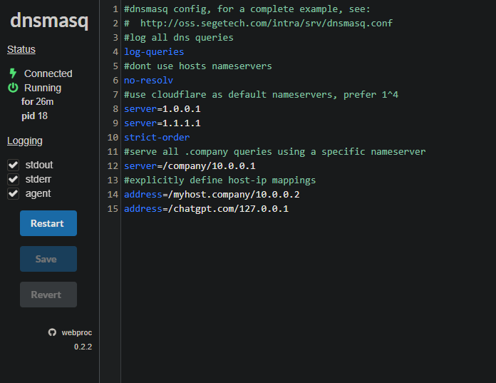

# LDAP

- Instalamos Dnsmask con un compose en el que para levantarlo tendremos que comentar el volumen

[docker-compose](./docker/docker-compose.yml)

- Ejecutamos el siguiente comando

```bash
docker exec -it dnsmasq-dns-1 cat /etc/dnsmasq.conf > dnsmasq.conf
``` 

- Ahora de que hagamos esto si esta el contenedor activo lo paramos y una vez
parado descomentamos las lineas que hemos comentado antes y volvemos a activar

- Hacemos el comando siguiente para saber nuestra direccion privada

```bash 
ip a | grep eth1
```

- Introduces esa ip con :5380 o el puerto que hallas puesto en el compose y entrarias al dnsmasq



- Vamos a ver que esto funciona si ponemos por ejemplo en ese archivo

```bash
address=/chatgpt.com/127.0.0.1
```

- En la terminal ponemos esto deberia darnos respuesta sin ningun error

```bash
dig chatgpt.com@127.0.0.1
```

